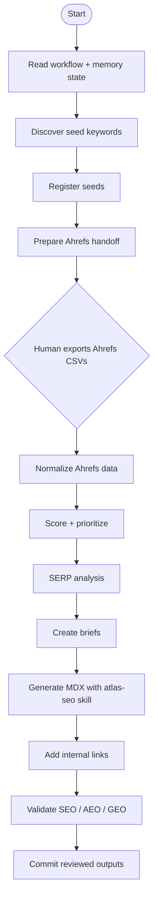

<p align="center">
  <strong>Jet SEO</strong>
</p>

<p align="center">
  AI search visibility workflow engine for SEO, AEO, GEO, and content operations.
</p>

<p align="center">
  <a href="https://github.com/Sethzy/jet-seo">GitHub</a>
  ·
  <a href="https://jet-seo-search-visibility-engine.vercel.app/jet-seo-search-visibility-engine.html">Portfolio artifact</a>
</p>

---

## Why Jet SEO Exists

Search marketing is changing from a keyword-and-blog workflow into a visibility
operations problem. Brands now need to understand where they appear across
Google, AI Overviews, ChatGPT-style answers, Perplexity-style research, and
category comparison pages.

Jet SEO is a machine-executable workflow pack for that world. It turns SEO work
into a staged system:

```text
seed discovery -> Ahrefs validation -> scoring -> SERP analysis -> briefs
-> MDX generation -> internal links -> validation -> commit
```

The repo is intentionally workflow-first. It shows how an agent can take a
content program from messy opportunity discovery to reviewable, publish-ready
assets without pretending the human disappears.

## What It Does

- Discovers new keyword seeds across competitor gaps, audience pain points,
  long-tail questions, and adjacent topics.
- Uses Ahrefs exports as the quantitative handoff for difficulty, volume,
  parent topic, and traffic potential.
- Scores keywords with business value, traffic potential, funnel stage, search
  intent, and content type.
- Converts approved opportunities into evidence-backed content briefs.
- Generates MDX posts through a dedicated `atlas-seo` skill with copywriting,
  brand voice, AEO/GEO structure, and AI-writing avoidance rules.
- Adds internal links through a hub-and-spoke workflow.
- Validates SEO basics, answer-engine structure, frontmatter sync, and common
  AI-writing tells before commit.

## Workflow Map



## Key Files

| File | Purpose |
| --- | --- |
| `WORKFLOW.md` | Full 11-step runbook for the SEO content pipeline. |
| `MEMORY_STATE.md` | Resume state for long-running or compacted agent sessions. |
| `CLAUDE.md` | Quick-start guide and project structure. |
| `.claude/commands/atlas-seo-pipeline.md` | Visual workflow command definition. |
| `.claude/agents/*.md` | Step-specific agent prompts for discovery, registration, Ahrefs prep, scoring, briefs, validation, and commit. |
| `.claude/agents/skills/atlas-seo.md` | The content generation skill used at Step 8. |
| `docs/market-landscape.md` | Market context for AI search visibility, AEO, GEO, and funded competitors. |

## Execution Model

Jet SEO uses a batch-then-advance model. It does not waterfall one keyword all
the way from research to publish while the rest of the queue stays untouched.

Instead:

1. All eligible seeds are discovered and registered.
2. All Ahrefs exports are consolidated.
3. All validated keywords are scored and clustered.
4. All approved keywords get SERP analysis and briefs.
5. All approved briefs become MDX.
6. All new posts receive links and validation.

This keeps the content program auditable. At any point, `MEMORY_STATE.md` tells
the next agent where to resume.

## Human-In-The-Loop Boundary

The main human handoff is Ahrefs export. The workflow prepares the instructions,
but a person still decides whether to spend credits and save CSVs.

The review stance is conservative:

- AI output is draft work, not truth.
- Named tool claims need evidence.
- SEO/AEO/GEO checks run before commit.
- Production traffic, ranking, and revenue claims are out of scope unless backed
  by later analytics.

## Market Context

AI search visibility has become a funded marketing category. Companies such as
[Profound](https://www.tryprofound.com/blog/profound-raises-96m-series-c),
[Peec AI](https://peec.ai/blog/we-raised-21m-series-a-to-help-brands-win-in-ai-search),
[Bluefish](https://www.bluefishai.com/blog/bluefish-raises-43-million-series-b-to-power-agentic-marketing-for-the-fortune-500),
[daydream](https://www.prnewswire.com/news-releases/daydream-raises-15m-series-a-to-build-the-worlds-best-ai-native-agency-for-seo-302732302.html),
[Evertune](https://www.evertune.ai/resources/insights-on-ai/evertune-raises-15-million-series-a-to-scale-its-ai-marketing-and-discovery-platform),
and [Scrunch AI](https://www.prnewswire.com/news-releases/scrunch-ai-raises-15-million-series-a-to-rebuild-the-internet-for-ai-consumption-302510915.html)
are building around monitoring, content gaps, brand visibility, and agentic
marketing workflows.

Jet SEO is a public proof-of-work artifact for the operations layer of that
market: how research becomes briefs, content, internal links, and validated
publish-ready output.

## Quick Start

Use the workflow with an agent that can read the repo:

```text
@WORKFLOW.md @MEMORY_STATE.md go
```

The agent should read `WORKFLOW.md`, inspect `MEMORY_STATE.md`, identify the
current step, and execute only the items in scope.

## Status

Public portfolio artifact. The workflow is designed to be adapted to a real
content codebase with:

- `docs/marketing/data/*.csv`
- `docs/marketing/keywords/briefs/*.md`
- `content/blog/*.mdx`
- an Ahrefs export folder
- audit scripts for the target site
