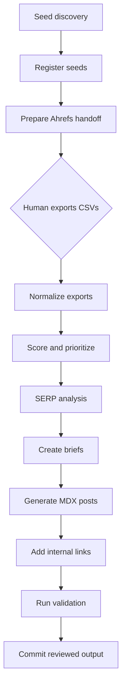

<p align="center">
  <strong>SEO Workflow</strong>
</p>

<p align="center">
  A stateful SEO/AEO/GEO operating system for turning keyword research into briefs, articles, internal links, and QA-ready content.
</p>

<p align="center">
  <a href="WORKFLOW.md">Workflow runbook</a>
  ·
  <a href="MEMORY_STATE.md">Memory state</a>
  ·
  <a href="docs/market-landscape.md">Market landscape</a>
  ·
  <a href="https://acme-editorial-samples.vercel.app/posts/">Sample output archive</a>
</p>

---

## What This Is

SEO Workflow is a public, GitHub-native artifact for a repeatable content
operations system. It is not just a blog template, keyword list, or prompt pack.
It is an execution model for taking a messy SEO/AEO/GEO content program from
idea discovery to publish-ready assets with traceable state at every step.

The workflow is designed for AI search visibility work, where a team needs to
rank in classic Google results, appear in answer-engine style summaries, and
build enough topical authority that comparison pages, guides, and long-tail
questions reinforce each other.

In plain English:

1. Find the questions and topics people are already searching for.
2. Check whether those opportunities are worth chasing.
3. Score and cluster the good opportunities.
4. Study what currently ranks.
5. Turn the best opportunities into evidence-backed briefs.
6. Draft articles from those briefs.
7. Add internal links so the content works as a system.
8. Run QA before anything gets committed or published.

The core idea is that SEO work should behave like an operating system, not a
pile of one-off documents.

## Why It Exists

Content operations usually break in the same places:

- Keyword ideas live in notes, spreadsheets, Ahrefs exports, and someone's head.
- Broad keywords look attractive but are too competitive or vague.
- Long-tail questions get discovered once and then lost.
- Briefs are written from vibes instead of SERP evidence.
- AI drafts sound polished but are not always accurate, differentiated, or
  matched to search intent.
- Internal links are added manually after the fact, if they are added at all.
- Nobody knows where the workflow stopped after a long session.

SEO Workflow solves that by making the process stateful. The CSVs hold item-level
truth, `MEMORY_STATE.md` holds run-level truth, and `WORKFLOW.md` tells the next
agent or operator exactly what to do next.

## What A Run Produces

A complete workflow run produces a structured editorial queue:

| Output | What It Contains | Why It Matters |
| --- | --- | --- |
| Seed keyword list | Candidate long-tail questions, competitor gaps, audience pain points, adjacent topics | Prevents the team from chasing only obvious broad keywords |
| Ahrefs handoff | Grouped keywords and export instructions | Keeps paid/manual tool use explicit and reviewable |
| Validated keyword table | KD, volume, traffic potential, parent topic, intent, funnel stage | Turns ideas into measurable opportunities |
| Priority queue | Business value, traffic potential, difficulty-adjusted score, approval status | Shows what should be written first |
| SERP analysis | Top pages, content format, competitor strengths, weak spots | Makes briefs evidence-backed |
| Content briefs | Target keyword, outline, angle, internal links, benchmarks | Gives writers and agents a real source of truth |
| MDX posts | Publish-ready article drafts with synced frontmatter | Converts strategy into shippable assets |
| Internal link map | Outbound/inbound targets and anchor ideas | Builds topical authority across the site |
| QA record | SEO/AEO/GEO checks, frontmatter sync, writing-pattern checks | Reduces bad publishes |

## Workflow At A Glance



The human does not disappear. The human is deliberately placed at the points
where judgment, budget, or public-facing risk matters: paid research exports,
approval/defer decisions, final review, and publishing.

## Operating Model

The workflow uses a batch-then-advance model.

Instead of taking one keyword all the way from discovery to post while the rest
of the queue sits untouched, each phase processes the whole eligible batch:

1. Discover all candidate seeds.
2. Register every seed in the structured tracker.
3. Prepare the Ahrefs handoff for every unresearched seed.
4. Normalize every new Ahrefs export.
5. Score and cluster every validated keyword.
6. Analyze SERPs for every approved opportunity.
7. Create briefs for every approved opportunity.
8. Generate posts for every approved brief.
9. Add internal links across the full new set.
10. Validate everything before commit.

That shape matters because it keeps the program auditable. At any point, a new
operator can read the state files and resume without asking, "Wait, where were
we?"

## Data Layer

All structured workflow data lives in CSVs under the target content codebase.
The CSVs are the source of truth for workflow state. MDX frontmatter is the
source of truth for published content.

| Data File | Role |
| --- | --- |
| `keyword-seeds.csv` | Raw seed keywords and their funnel stage, source, date, status, and notes |
| `seed-groups.csv` | Ahrefs-ready seed batches grouped by BOFU/MOFU/TOFU |
| `keywords-validated.csv` | Validated opportunities with KD, volume, traffic potential, business value, intent, content type, pillar, cluster, and status |
| `serp-analysis.csv` | Top results, content format, competitor strengths, opportunity type, and notes |
| `competitor-keywords.csv` | Competitor domain, keyword, position, KD, volume, and traffic potential |
| `content-briefs.csv` | Brief IDs, target keywords, outline status, internal-link status, benchmark status, owner, and workflow status |
| `blog-posts.csv` | Published or drafted posts, primary keyword, brief ID, word count, QA violations, skills used, dates, ranking state, and status |
| `keyword-blog-mapping.csv` | Primary, secondary, and supporting relationships between keywords and posts |
| `ahrefs-exports.csv` | Registry of paid/manual exports, source keywords or domains, file paths, imported rows, and processing status |

The important pattern is that an article is not "done" because a draft exists.
It becomes done when the data layer, brief, article, links, and validation state
agree with each other.

## Scoring Model

The default opportunity score is intentionally simple:

```text
priority_score = (business_value * traffic_potential) / (keyword_difficulty + 1)
```

That gives the workflow a practical bias:

- high business relevance beats empty traffic
- high traffic potential is useful only when the topic matters
- lower difficulty creates a real opening for newer or lower-authority sites
- every keyword still needs human-readable rationale, not just a number

Business value is scored from 1 to 5:

| Score | Meaning |
| --- | --- |
| 5 | Direct buying, comparison, migration, or tool-selection intent |
| 4 | Strong solution-aware intent with clear product or workflow fit |
| 3 | Useful mid-funnel educational intent that can support a cluster |
| 2 | Tangential informational topic with weak conversion path |
| 1 | Broad, vague, or low-fit topic that should usually be deferred |

The score is not a magic answer. It is a sorting mechanism that makes tradeoffs
visible.

## Step-By-Step Workflow

### 1. Discover Topic Ideas

The workflow starts by looking for topic ideas from five places:

- competitor content gaps
- audience pain points from forums, communities, and search behavior
- emerging trends in the category
- long-tail questions with clear intent
- adjacent topics that pull in relevant readers

The goal is not to collect every keyword. The goal is to find questions where a
specific, useful article can be the best answer.

Example:

```text
Bad broad target: SEO
Better long-tail target: how to track brand visibility in AI search
```

The long-tail version is easier to understand, easier to answer, and easier to
map to a useful article.

### 2. Register Seeds

Every seed becomes a row with:

- the seed text
- funnel stage
- discovery source
- date added
- status
- notes

This prevents the team from rediscovering the same ideas every week.

### 3. Prepare Ahrefs Research

The agent groups seeds into BOFU, MOFU, and TOFU batches and writes a human-ready
research handoff.

The handoff says:

- which CSV to open
- which seeds to paste into Ahrefs
- which filters to apply
- which columns to export
- where to save the CSV
- how to signal completion

Ahrefs stays human-controlled because it costs credits and because the operator
may want to sanity-check the query set before spending them.

### 4. Normalize Exports

When Ahrefs exports are saved, the workflow imports them into the structured
data layer.

This step:

- registers each export
- normalizes messy column names
- deduplicates existing keywords
- updates metrics when needed
- imports competitor keyword rows
- marks processed files as complete

Raw exports stop being loose files and become workflow state.

### 5. Score And Prioritize

Validated keywords are scored using business value, traffic potential, keyword
difficulty, funnel stage, intent, and content type.

Each row gets:

- `business_value`
- `bv_rationale`
- `priority_score`
- `search_intent`
- `content_type`
- `pillar`
- `cluster`
- `status`

The output is a queue of approved, deferred, and already-covered opportunities.

### 6. Analyze SERPs

The workflow studies what currently ranks before writing anything.

For each approved keyword it records:

- top-ranking URLs
- top-ranking titles
- dominant content format
- competitor strengths
- weak spots
- opportunity type
- notes

This is the step that keeps a brief from becoming generic. If the SERP is all
comparison pages, the article should not pretend to be a broad beginner guide.
If the SERP is full of outdated listicles, the article can win with freshness,
specificity, and better structure.

### 7. Create Briefs

The brief turns the keyword and SERP evidence into a writing plan.

A good brief includes:

- primary keyword
- search intent
- article angle
- recommended title
- outline
- required sections
- competitor benchmarks
- internal links to include
- related articles that should link back
- notes about what not to claim

The brief is the contract between research and writing.

### 8. Generate Articles

Approved briefs become MDX posts.

The content generation step is constrained by:

- brand voice
- SEO structure
- AEO/GEO answer formatting
- frontmatter requirements
- internal link requirements
- AI-writing avoidance rules
- evidence and claim boundaries

The output is a draft that is ready for review, not something blindly published.

### 9. Add Internal Links

New content is connected to the existing content graph.

The workflow checks:

- links from the new post to relevant existing posts
- links from existing posts back to the new post
- anchor text
- cluster coverage
- hub-and-spoke structure

This matters because isolated articles rarely build category authority by
themselves.

### 10. Validate

Validation checks that the article is structurally and strategically ready.

Typical checks:

- `primaryKeyword` exists in the validated keyword table
- search intent matches the CSV
- cluster and pillar match the data layer
- slug matches the registered blog slug
- required frontmatter exists
- internal links are present
- content answers the query directly
- comparison and recommendation claims are grounded
- AI-writing patterns are removed

The goal is to catch weak output before it hits production.

### 11. Commit

Only reviewed outputs are committed.

The commit boundary matters because it separates "agent generated something"
from "the workflow produced a traceable, reviewable artifact."

## Human-In-The-Loop Gates

The workflow is autonomous where automation is safe and explicit where judgment
is needed.

| Gate | Owner | Reason |
| --- | --- | --- |
| Ahrefs export | Human | Paid/manual tool use and research-budget control |
| Approve/defer queue | Human or lead operator | Business judgment and prioritization |
| Final article review | Human | Public-facing quality and claim risk |
| Publishing | Human or site workflow | Production control |

This is the same pattern a good AI workflow should use in GTM, marketing ops,
sales ops, support ops, and research ops: automate the repetitive structure,
preserve human judgment at consequential boundaries.

## Repository Map

| File | Purpose |
| --- | --- |
| `WORKFLOW.md` | Full machine-executable runbook with phases, schemas, step preambles, completion conditions, and resume rules |
| `MEMORY_STATE.md` | Current workflow checkpoint and long-running session resume state |
| `CLAUDE.md` | Quick-start instructions for running the workflow with an agent |
| `.claude/agents/*.md` | Step-specific executor prompts for discovery, registration, Ahrefs prep, consolidation, prioritization, briefs, linking, validation, and commit |
| `.claude/commands/*.md` | Command-level workflow entry points |
| `.claude/agents/skills/*.md` | Content-generation skill instructions used during article production |
| `docs/market-landscape.md` | Market framing for AI search visibility, AEO, GEO, and funded competitors |

## How To Run It

Give an agent these two files:

```text
@WORKFLOW.md @MEMORY_STATE.md go
```

The agent should:

1. Read the workflow.
2. Read the memory state.
3. Identify the current step.
4. Inspect the CSVs or files named by that step.
5. Execute only the next in-scope work.
6. Update the CSVs and memory state.
7. Stop at any human handoff.

The runbook is intentionally self-contained. If a future operator only has
`WORKFLOW.md` and `MEMORY_STATE.md`, they should still be able to understand
where the workflow is and what needs to happen next.

## Sample Output

The sample output archive shows what the workflow can produce when populated
with article copy and rendered as a clean editorial portfolio:

[acme-editorial-samples.vercel.app/posts](https://acme-editorial-samples.vercel.app/posts/)

The archive is intentionally separate from this repo. This repo explains the
operating system; the archive shows one possible output surface.

## What This Proves

This project demonstrates an AI workflow pattern that is useful beyond SEO:

- turn repeated knowledge work into a stateful process
- separate discovery, validation, production, and QA
- keep human approval where the risk or cost is real
- use structured data as the memory layer
- make agent work resumable after context loss
- create public artifacts without exposing internal operating notes
- package the pattern so another operator can run it later

For marketing and GTM teams, that is the actual leverage: not "AI writes a blog
post," but "AI helps run a trustworthy content operation."

## What It Does Not Claim

This repo does not claim:

- automatic first-page rankings
- automatic revenue attribution
- replacement of editorial judgment
- live integration with Ahrefs APIs
- production analytics from a real deployed content program

It is an operating artifact: the system shape, data contracts, gates, and
execution instructions.

## Status

Public workflow artifact. The internal visual artifact is intentionally not the
portfolio surface; the public GitHub README and runbook are the durable reference
for how the system works.
